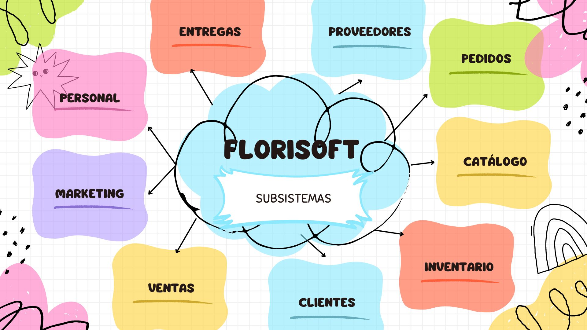

# REPOS_IAN

<!DOCTYPE html>

Azul.

<html>

<head>

    <meta charset="UTF-8">
    <meta name="viewport" content="width=device-width, initial-scale=1.0">
    <title>Cambiar Color de Fondo</title>
</head>
<body style="background-color: lightblue;">
    <h1>Bienvenido a Florisoft</h1>
    
Flores y adornos de la mejor calidad.

</body>
</html>

    <meta charset="UTF-8">
    <meta name="viewport" content="width=device-width, initial-scale=1.0">
    <title>FLORISOFT</title>
    
</head>
<body>
    <h1 class="centrado">FLORISOFT.</h1>
    <body>
        
        <h2>Florería Floretti amore</h2>

        
 Misión: Transformar la experiencia de venta en florerías mediante un
            software innovador que optimiza la gestión de pedidos, mejora la atención
            al cliente y maximiza la eficiencia operativa. Nos comprometemos a brindar
            a los floristas las herramientas necesariasd para crear conexiones significativas
            con sus clientes, asegurando que cada pedido refleje calidad y frescura.

            
Objetivo: Desarrollar un software que gestione y realice pedidos de una florería,
                digitalizando todo el proceso de tal forma que estos puedan ser funcionales,
                ágiles y fáciles de manipular para cualquier usuario.
                
                <title>Insertar Imagen</title>
            </head>
            <body>
                <h3>Subsistemas de Florisoft</h3>
                

                <title>VISITA NUESTRAS SECCIONES:</title>
                
            </head>
            <body>
            
                <nav>
                    <a href="#clientes.html">Clientes</a>
                    <a href="#inventario.html">Inventario</a>
                    <a href="#contacto">Contacto</a>
                </nav>
            
                <section id="catalogo">
                    <h2>Catálogo de Automóviles</h2>
                    
Aquí encontrarás una variedad de automóviles.

                </section>
            
                <section id="ofertas">
                    <h2>Ofertas Especiales</h2>
                    
Mira nuestras ofertas especiales del mes.

                </section>
            
                <section id="contacto">
                    <h2>Contacto</h2>
                    
Ponte en contacto con nosotros para más información.

                </section>

               
    </body>
</head>

</html>